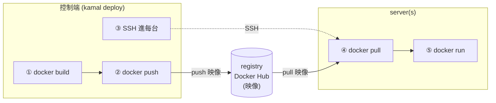

# Sendora 部署控制端:本機 vs CI(GitHub Actions)

> 誰按下 `kamal deploy`、在哪台機器 build 映像 —— 這台「控制端」可以是你的**本機**,
> 也可以換成 **CI(GitHub Actions)**;Kamal 的部署機制完全不變,只是換誰執行。
>
> 單機操作步驟見 [KAMAL_DEPLOY.md](KAMAL_DEPLOY.md);
> 部署總覽見 [IMPLEMENTATION_GUIDE.md §8](IMPLEMENTATION_GUIDE.md#8-部署kamal單機)。

## 一句話定位

Kamal 是 **控制端工具**:你在控制端下 `kamal deploy`,它就

> ① 在控制端 `docker build` → ② push 映像到 registry → ③ 逐台 SSH 進 server → ④ server 從 registry `pull` → ⑤ `docker run`。

**server 端不裝 Kamal、不放原始碼**,只要有 Docker + 你的 SSH key;它拿到的永遠只是一個打包好的映像。

所以「控制端是誰」決定權在你 —— 本機或 CI 都行。

## Kamal 做的兩件事

| # | 階段 | 在哪做 | 需要什麼 |
|---|---|---|---|
| 1 | build 映像 → push registry | **控制端** | Docker + 完整原始碼 + Dockerfile |
| 2 | SSH 進 server → pull → run | **控制端 → server** | 控制端有 SSH 私鑰;server 有 Docker |

> 因為第 1 件事要讀程式碼打包,**控制端一定要有整包 repo + Docker**;
> server 端則完全不碰原始碼,只負責跑映像。

## 控制端 / server 各需要什麼

**控制端(本機或 CI):**

| 需要 | 為什麼 |
|---|---|
| Kamal(CLI) | 下指令的工具 |
| `config/deploy.yml` + `.kamal/secrets` | 連哪些機器、用什麼映像、注入哪些 env/密碼 |
| 能連到 server 的 SSH 私鑰 | Kamal 靠它逐台 SSH |
| Docker + 完整原始碼 | build 映像用(若 build 交給別處則免) |

**控制端不需要**:跑得起來的 Rails 環境、可用的 Ruby、本機資料庫 —— Kamal 不在控制端跑這個 app,它只是「打包 + 遠端指揮」。(就算本機 Ruby 跑不動 Rails 8.1 也沒關係,那是「跑 app」的需求,跟「用 Kamal 部署」是兩回事;本專案的 kamal 本身用官方 docker image 跑,見 [KAMAL_DEPLOY.md](KAMAL_DEPLOY.md) §5。)

**server 端**:只要 Docker + 你的 SSH key;映像從 registry 拉,**零設定、零原始碼**。

> 注意:映像**不是**從控制端直接傳到 server,而是經過 **registry 中轉**(控制端 push、server 各自 pull)。所以 registry 一定要每台都連得到 —— 本專案用 Docker Hub 私有 repo。

## 控制端:本機 vs CI(GitHub Actions)

把控制端從筆電換成 CI,被替代的就是「那台執行的機器」,Kamal 機制一模一樣:

| 動作 | 本機部署 | 換成 GitHub Actions |
|---|---|---|
| 誰執行 `kamal deploy` | 你手動敲 | push / merge 到 main 自動觸發 |
| 在哪 build 映像 | 你本機的 Docker | Actions runner 的 Docker |
| push 到 registry | 本機 | runner |
| SSH 進 server | 本機的 SSH 私鑰 | runner 用存在 **GitHub Secrets** 的私鑰 |
| `deploy.yml` | 放本機 repo | 同一份(進 git,不用改) |
| secrets 來源 | `~/.sendora-deploy.env` | **GitHub Secrets / Environments** |

## 為什麼正式團隊常搬到 CI

機制本身(控制端 SSH 進 server 跑 docker)是 production-grade 的 —— 37signals 的 HEY / Basecamp 就這樣跑。差別只在「控制端」放哪:

- **個人 / 小團隊 / 早期** → 本機直接 deploy,完全正常。
- **有規模 / 多人 / 正式產品** → 控制端通常是 **CI**,原因:
  1. **架構一致**:本機若是 Mac(arm64)、server 是 amd64,本機 build 的映像架構會對不上;CI runner 預設 amd64,直接對齊。(Sendora 開發機是 Linux x86,本來沒這問題,但 CI 一樣穩。)
  2. **可重現**:CI 是乾淨環境,映像不沾某台筆電的本機狀態。
  3. **密鑰集中**:正式 secrets / SSH key 放 CI,比散在每人筆電安全。
  4. **多人協作**:綁「merge 到 main 就部署」= 單一真相來源 + 有部署紀錄(誰、何時、部了什麼)。

## 不是非此即彼

設好 CI 後,**本機仍可手動 `kamal deploy`**(緊急 / 半夜救火很好用)。CI 只是日常主力,不會拿掉本機的能力。

## 搬到 CI 時要動的東西(之後真的要做再參考)

- **secrets 搬家**:現在 `.kamal/secrets` 讀的值(`KAMAL_REGISTRY_PASSWORD`、`RAILS_MASTER_KEY`、`SENDORA_DATABASE_PASSWORD`、`SMTP_*`)改放 **GitHub Secrets**,不寫進 repo。
- **SSH 私鑰給 runner**:能連到 server 的私鑰放 GitHub Secrets,workflow 注入;server 的 `authorized_keys` 不用改(認的是同一把 key)。
- **`deploy.yml` 不變**:同一份設定,本機與 CI 共用。
- **現成範本**:`kamal init` 會生出 `.github/workflows` 的部署 workflow 範例,填 server / secrets 名稱即可。

## 對 Sendora 的建議

| 階段 | 控制端 |
|---|---|
| **現在**(單機、一人) | **本機**就好,別過早接 CI。現況甚至是「控制端 = server 同一台」(SSH 回自己),見 [KAMAL_DEPLOY.md](KAMAL_DEPLOY.md)。 |
| 不只你一個人在部署 / 手動部署開始覺得煩 | 把同一份 `deploy.yml` 接上 **GitHub Actions**,改動很小。 |

> 「控制端放哪」與「幾台 server」是**兩條獨立的軸**:多台 server(DB 獨立機 / 多 web)是另一個主題,跟控制端是本機還是 CI 無關。
