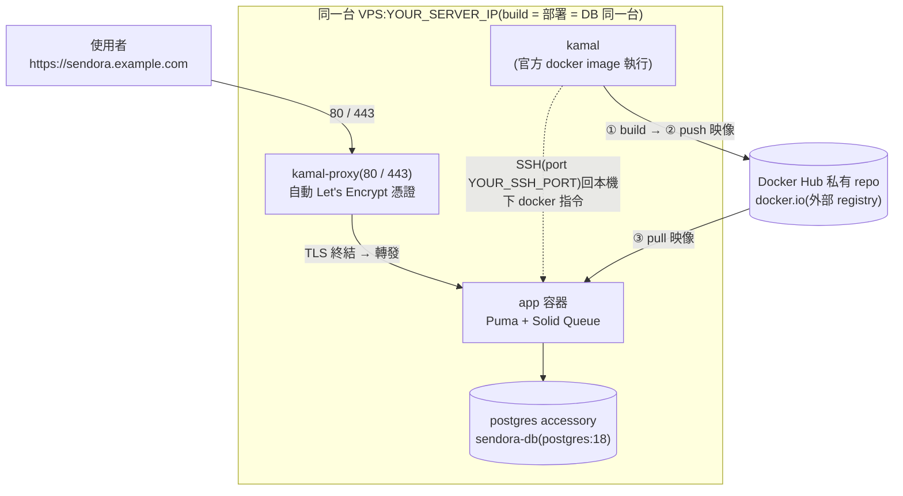

# Sendora 單機 Kamal 部署筆記

> 這台機器 = build 機 = 部署機 = DB 機(全部在 `YOUR_SERVER_IP` 同一台)。
> 用 Kamal 2 + kamal-proxy,HTTPS 由 Let's Encrypt 自動簽發,映像推到 **Docker Hub 私有 repo**
> (單機部署用本機 registry 會踩死結,原因見文末〈為什麼不用本機 registry〉)。
>
> 本檔是單機操作 runbook。「誰當控制端執行部署、在哪 build」的定位(本機 vs CI / GitHub Actions)
> 見 [DEPLOY_CONTROL_PLANE.md](DEPLOY_CONTROL_PLANE.md)。

---

## 1. 部署架構



- **網域**:`sendora.example.com`,A 記錄指向 `YOUR_SERVER_IP`。
- **dev 環境不受影響**:`docker compose up` 的 `:3000` 與這套(80/443、獨立 postgres accessory)互不衝突。

---

## 2. 關鍵決定與理由

| 決定 | 理由 |
|---|---|
| 用 **Kamal** 部署 | 專案內建(`config/deploy.yml`、`bin/kamal`),正式上線就走這套 |
| **HTTPS 走 kamal-proxy + Let's Encrypt** | `proxy.ssl: true` + `proxy.host` 設網域,proxy 自動簽憑證、自動續期。**純 IP 簽不到憑證,一定要有能解析到本機的網域** |
| **一定要有 SSH** | Kamal 的運作模型就是「從控制機 SSH 到 `servers:` 清單的機器下 docker 指令」,**沒有免 SSH 模式**;即使同一台也是 SSH 回自己 |
| SSH 用 **port YOUR_SSH_PORT 而非 22** | 本機 sshd 本來就開在 YOUR_SSH_PORT;Kamal 用 `ssh.port` 指定即可。同一台部署,SSH 不需對公網特別開放 |
| **registry 用 Docker Hub 私有 repo** | 映像 push 到 `docker.io` 私有 repo、server 再 pull。單機自架本機 registry 會踩 Kamal 死結(見 §10 附錄),不值得 |
| kamal 用 **官方 docker image** 執行 | 不依賴 host 的 Ruby(本機 Ruby 不一定跑得動 kamal gem / Rails 8.1),改用 `ghcr.io/basecamp/kamal` 容器 |
| secrets 放 **repo 外的 env 檔** | `~/.sendora-deploy.env`(權限 600),`.kamal/secrets` 從環境變數帶入,絕不進版控 |

---

## 3. 前置條件清單

| 項目 | 備註 |
|---|---|
| 網域,且 DNS A 記錄指向伺服器 IP | 純 IP 簽不到 Let's Encrypt 憑證,一定要有網域 |
| `config/master.key`(RAILS_MASTER_KEY 來源) | gitignore,不入版控 |
| 伺服器裝好 docker,部署帳號在 docker 群組 | |
| sshd 在跑 | 本專案用 port `YOUR_SSH_PORT` |
| 可免密碼 SSH 登入、且能跑 docker 的部署金鑰 | 本專案放 `~/.ssh/kamal_local` |
| 80 / 443 未被占用 | dev 的 `:3000` 不衝突 |
| 防火牆對外開放 80 / 443 | 雲端安全群組 + 本機防火牆都要開;Let's Encrypt 走 HTTP-01,簽憑證失敗先查這項 |

---

## 4. 前置設定步驟

### 4.1 SSH 部署金鑰
```bash
ssh-keygen -t ed25519 -f ~/.ssh/kamal_local -N "" -C "kamal-local-deploy"
cat ~/.ssh/kamal_local.pub >> ~/.ssh/authorized_keys
# 還原:移除 authorized_keys 中那行 + 刪 ~/.ssh/kamal_local*
```

### 4.2 `config/deploy.yml` 要填的欄位
| 欄位 | 填什麼 |
|---|---|
| `servers.web` / `accessories.db.host` | 你的伺服器 IP |
| `proxy.host` / `env.clear.APP_HOST` | 你的網域 |
| `env.clear.MAILER_FROM` | 寄件地址(你的網域) |
| `ssh` | `user` / `port` / `keys`(指向部署金鑰,如 `~/.ssh/kamal_local`) |
| `registry` + `image` | Docker Hub:`server: docker.io`、私有 repo(如 `your-dockerhub-user/sendora`) |

### 4.3 Docker Hub 私有 repo(registry)
- 在 Docker Hub 先建好**私有** repo `your-dockerhub-user/sendora`(不先建會被自動建成 public)。
- 產一把 **Read & Write** access token,填進 `~/.sendora-deploy.env` 的 `KAMAL_REGISTRY_PASSWORD`。

> 單機部署為何不自架本機 registry,見文末〈為什麼不用本機 registry〉。

### 4.4 secrets 檔(repo 外,600)
`~/.sendora-deploy.env`:
```bash
export SENDORA_DATABASE_PASSWORD='<自動產生的隨機字串>'
export KAMAL_REGISTRY_PASSWORD='<Docker Hub access token>'
export SMTP_USERNAME='dummy'     # 測 HTTPS 階段先 dummy;要真寄信再換
export SMTP_PASSWORD='dummy'
# RAILS_MASTER_KEY 由 .kamal/secrets 直接 `cat config/master.key` 帶入,不放這裡
```

---

## 5. 如何執行 kamal(本機沒有可用 Ruby)

每次都用官方 image 跑;先 `source` secrets 再執行。建議在 `~/.bashrc` 設一個 alias:

```bash
# ~/.bashrc
kamal() {
  ( cd /home/YOUR_USER/sendora \
    && source ~/.sendora-deploy.env \
    && docker run --rm -it \
        -v "$PWD:/workdir" \
        -v /var/run/docker.sock:/var/run/docker.sock \
        -v "$HOME/.ssh:/root/.ssh:ro" \
        -e SENDORA_DATABASE_PASSWORD -e KAMAL_REGISTRY_PASSWORD -e SMTP_USERNAME -e SMTP_PASSWORD \
        ghcr.io/basecamp/kamal:latest "$@" )
}
```

設好之後就能直接 `kamal config`、`kamal deploy`、`kamal app logs -f` …(本檔以下都假設用這個 alias)。

> 註:`-v "$HOME/.ssh:/root/.ssh:ro"` 是讓容器內的 kamal 能用 `kamal_local` 金鑰 SSH 回本機。
> `config` 這類不連線的指令可不掛;`setup`/`deploy`/`logs` 等需要 SSH 的一定要掛。

驗證設定(不 SSH、不部署):
```bash
kamal config        # 應印出 hosts=YOUR_SERVER_IP、repository=your-dockerhub-user/sendora …
```

---

## 6. 首次部署:`kamal setup`

```bash
# 建議先 commit deploy.yml(Kamal 用 git SHA 當映像 tag,保持乾淨樹)
kamal setup
```

`kamal setup` 會依序:
1. SSH 進本機 → 啟動 **postgres accessory**(`sendora-db`,獨立於 dev 的 DB)
2. 啟動 **kamal-proxy**,占用 **80 / 443**
3. 用 `Dockerfile` build production 映像 → push 到 **Docker Hub**(`your-dockerhub-user/sendora`)→ server `docker pull` → 部署 **app 容器**(跑 `db:prepare`)
4. kamal-proxy 對 `sendora.example.com` 自動申請 **Let's Encrypt 憑證**
5. 完成 → 開 **https://sendora.example.com**(綠色鎖頭)

耗時約 3–6 分鐘(主要在 build 映像)。

### 6.1 `kamal setup` vs `kamal deploy`(重要,別搞混)
- **`kamal setup`** —— **只有第一次用**。做完整套基礎建設:建 network、登入 registry、
  起 accessory(`sendora-db`)、起 `kamal-proxy`,**最後內含執行一次 `kamal deploy`**。
  → 所以第一次 setup 就已經把 app 部署上線了(它包含 deploy,不必再另外 deploy)。
- **`kamal deploy`** —— **之後每次更新都用這個**。只做「build → push → pull → 滾動換 app 容器」,
  不再重弄 accessory / proxy 那些已經在跑的,比較輕、快。

| | `kamal setup` | `kamal deploy` |
|---|---|---|
| 時機 | 第一次 / 全新機器 | 之後每次改 code 要上線 |
| network / registry login | ✅ 建立 | 已在,略過 |
| accessory(db)/ proxy | ✅ 啟動 | 已在,略過 |
| build → push → pull → 換 app | ✅(內含一次 deploy) | ✅ 只做這段 |

> 一句話:**setup 是「開店裝潢 + 第一次上架」,deploy 是「之後每次補貨換貨」。**
> 改完 code 要上線 → `git commit` 後跑 **`kamal deploy`**(不是再 `kamal setup`)。

驗證:
```bash
curl -I https://sendora.example.com    # 看到 200/302 + 有效憑證即成功
kamal app logs -f                              # tail 應用日誌
```

### 憑證簽不到時(Let's Encrypt 失敗額度有限)
先確認 **80 埠外網真的打得進來**(LE 走 HTTP-01,從外網打你的 80)。
排查期間可改用 LE **staging** 環境演練,確認流程沒問題再簽正式憑證,避免撞正式環境額度。

---

## 7. 日常維運 cheatsheet

```bash
kamal deploy                 # 之後每次更新(build → push → 滾動換新容器)
kamal redeploy               # 不重設 proxy/accessory,只換 app
kamal rollback <版本SHA>      # 回滾到舊映像
kamal app logs -f            # tail app 日誌
kamal app exec -i --reuse "bin/rails console"   # 線上 console(= alias `kamal console`)
kamal app exec -i --reuse "bash"                # 進容器 shell
kamal accessory logs db      # postgres 日誌
kamal proxy reboot           # 重啟 kamal-proxy
kamal details                # 看所有容器狀態
```

改 secrets / 環境變數:
- 改 `~/.sendora-deploy.env` 後重新 `kamal deploy`(或 `kamal env push`)。
- `env.clear`(非機密,如 `APP_HOST`)直接改 `deploy.yml` 再 deploy。

### 7.1 HTTPS 憑證:位置與自動續約
- 憑證存在 Docker volume **`kamal-proxy-config`**(host 路徑
  `/var/lib/docker/volumes/kamal-proxy-config/_data/`),內含
  `certs/<hash>/sendora.example.com` 與 `acme_account+key`。
- 是 **volume**,所以 `kamal deploy` / `kamal proxy restart` / **重開機都不會掉**。
- **自動續約**:kamal-proxy 內建 ACME,Let's Encrypt 90 天憑證會在到期前(約剩 30 天)
  自動續,**完全不用人工處理**。前提:proxy 在跑、80/443 對外通、網域指向不變、volume 沒被刪。
- ⚠️ 別長時間 `kamal proxy stop`(停超過續約窗口會沒機會續);也別刪 `kamal-proxy-config` volume。

### 7.2 暫停 / 啟動服務
只暫停網站(保留 HTTPS + DB,最常用):
```bash
kamal app stop      # 暫停:app 容器停掉(訪客吃 502,proxy/憑證/DB 都在)
kamal app start     # 恢復
```
整個服務都暫停 / 恢復:
```bash
kamal app stop && kamal proxy stop && kamal accessory stop db      # 暫停
kamal accessory start db && kamal proxy start && kamal app start   # 恢復(順序反過來)
```
- 容器是 `--restart unless-stopped`:**重開機會自動起**;但手動 `stop` 的會維持停止,要 `start` 才回來。
- 看狀態:`kamal app details` / `kamal proxy details`。
- ⚠️ `kamal remove` 是「**整個拆掉**」(刪 app/proxy/accessory 容器)**不是暫停**;
  DB 資料(bind mount `~/sendora-db/data`)還在,但要重新 `kamal deploy` 才回得來。

### 7.3 設定與資料放在哪裡 / 備份
Kamal 的東西散在**四處**,用途不同:

**A. 你會「編輯」的設定 —— repo 內(進 git)**
| 檔案 | 作用 |
|---|---|
| `config/deploy.yml` | 主設定:伺服器 IP、registry、proxy/網域、env、accessory、ssh |
| `.kamal/secrets` | secrets **範本**(只寫變數名、無明碼,故可進 git) |
| `.kamal/hooks/*.sample` | 部署生命週期 hook 範例(未啟用) |

**B. 「機密值」+ 跑 kamal 的工具 —— repo 外(不進 git)**
| 路徑 | 作用 |
|---|---|
| `~/.sendora-deploy.env`(600) | 機密本體:DB 密碼、SMTP、Docker Hub token |
| `~/.ssh/kamal_local`(+`.pub`) | 部署用 SSH 金鑰 |
| `~/.bashrc` 的 `kamal()` 函式 | 用 docker image 跑 kamal 的 wrapper |
| `config/master.key` | Rails 主金鑰(`.kamal/secrets` 會 `cat` 它;本來就 gitignore) |

**C. Kamal 在「伺服器端」產生的 —— 別手動動**
| 路徑 | 作用 |
|---|---|
| `~/.kamal/sendora-audit.log` | kamal 操作稽核紀錄 |
| `~/.kamal/proxy/`、`~/.kamal/apps/sendora/` | proxy 設定、上傳的 env 檔(**含解開的機密**,權限受限)、抽出的 assets |
| `~/sendora-db/data` | **正式 postgres 的資料**(bind mount) |

**D. Docker volumes(持久資料)**
| volume | 屬於 | 作用 |
|---|---|---|
| `kamal-proxy-config` | 正式 | HTTPS 憑證 + proxy 狀態 |
| `sendora_storage` | 正式 | ActiveStorage(上傳檔/匯入暫存) |
| `sendora_postgres-data`、`sendora_bundle` | 開發 | dev compose 的 DB / gem(與正式無關) |
| `buildx_buildkit_*` | build | 映像 build 快取 |

> ⚠️ 正式 DB 是 **`~/sendora-db/data`(bind mount)**,**不是** `sendora_postgres-data`(那是 dev 的)。兩者完全分開。

**萬一要備份 / 搬機器,真正要顧的三類:**
1. **設定**(進 git 就夠)→ `git push` 把 commit 推上去。
2. **機密**(沒進 git,機器掛了會丟)→ 另備 `~/.sendora-deploy.env`、`~/.ssh/kamal_local`、`config/master.key`。
3. **資料**(無價)→ `~/sendora-db/data`(DB)、`sendora_storage`、`kamal-proxy-config` 三份 volume/目錄。

---

## 8. 注意事項

- **寄真實信件**:secrets 範本的 `SMTP_*` 是 dummy(只夠測 HTTPS)。要寄活動信需在
  `~/.sendora-deploy.env` 填真實 SMTP 憑證,並把 `deploy.yml` 的 `SMTP_ADDRESS` 換成實際
  服務商(Mailgun / Postmark / SES);還要在網域設好 **SPF / DKIM / DMARC**,否則信會進垃圾桶或被退。
- **`deploy.yml` 改動後要 commit**:Kamal 用 git SHA 當映像 tag,工作樹要乾淨。
- **改名**:「Sendora」定案改名時,DB 名(`sendora_production`)、volume(`sendora_storage`)、
  registry repo、`service` / `image` 名都要一起換。
- **擴展**:量大了再把 Solid Queue 從 Puma 進程拆成獨立 job 伺服器(目前 `SOLID_QUEUE_IN_PUMA: true`)。

---

## 9. 選型:Kamal vs Caddy,各自適合什麼

### 9.1 Kamal 適合的場景

Kamal 的定位在「**手動 `docker run` / `docker compose`**」與「**Kubernetes**」之間 ——
給你零停機部署、回滾、secrets、多機管理,但**不用背 Kubernetes 的複雜度**。

**適合:**
- **想用自己的 VPS / 實體伺服器**(而非綁某家 PaaS),自己掌控成本與環境。
- 想要**滾動更新 / 回滾 / secrets / 多機**這些能力,但**不想碰 Kubernetes 的複雜度**
  —— 不用學 k8s / helm、不用養一個 control plane、不用一堆 YAML 與 operator。
- **單機到中小規模**(一台到少數幾台機器)的容器化部署。
- Rails 或一般容器化 web app(Kamal 是 37signals 為 Rails 量身做的,但通用)。

**這些情況要再評估:**
- 需要大規模自動擴縮、複雜排程、service mesh → 那才是 Kubernetes 的場景。
- 完全不想碰伺服器 / SSH / 維運 → 用 PaaS(Render / Fly.io / Heroku 之類)更省事。

### 9.2 不碰 Kamal、用 Caddy 反向代理(完全不需要 SSH)

只想**快速看到「網域 + 綠色鎖頭 HTTPS」能動**,不必整套 Kamal 時的替代路:

- 在這台**直接跑一個 Caddy 容器擋在前面**。Caddy 只要給它網域,就會**自動跟
  Let's Encrypt 申請憑證**(跟 kamal-proxy 同一個原理,但**不需要 SSH、不需要
  registry、不需要 Kamal**)。
- **後面接你現有的 app**。最快就只是想驗證 HTTPS 通不通,這條**5 分鐘就成**。
- **缺點**:它**不是**專案的正式部署路,跟 `deploy.yml` 那套是兩回事,純粹是測試 / 示範用。

### 9.3 兩者差別對照

| 面向 | **Kamal** | **Caddy(反向代理)** |
|---|---|---|
| 它本質是什麼 | 完整的**部署工具** | 只是 **web server / 反向代理** |
| 負責的範圍 | build 映像、push、跑容器、**滾動更新、回滾、DB accessory、secrets、多機** | 只負責「**TLS 終結 + 轉發到後端**」 |
| HTTPS / 憑證 | kamal-proxy 自動 Let's Encrypt | 自己自動 Let's Encrypt(同原理) |
| 需要 SSH | ✅ 要 | ❌ 不用 |
| 需要 registry | ✅ 要 | ❌ 不用 |
| app 怎麼跑 / 更新 | Kamal 一手包辦 | **你自己顧**(docker compose / 手動) |
| 上手速度 | 要設定 deploy.yml / SSH / registry | **5 分鐘**一個 Caddyfile |
| 是不是專案正式部署路 | ✅ 是(`config/deploy.yml`) | ❌ 否,測試 / 示範用 |
| 適合 | **正式上線 + 長期維運** | 只想**快速驗證 HTTPS**,或在前面單純擋一層 TLS |

**一句話**:Caddy 只解決「HTTPS 那一層」;Kamal 解決「**整個部署生命週期**」(HTTPS 只是其中一小塊)。
測試看效果用 Caddy 最快;要當正式上線流程、之後持續部署維運,就走 Kamal。

---

## 10. 附錄:為什麼不用本機 registry(改用 Docker Hub)

單機(build = 部署 = DB 同一台)時,Kamal 的「本機 registry」**兩種寫法都會踩死結**:

- `registry.server: localhost:5555` → Kamal 判定為本機 registry,`pull` 階段會對「遠端」做一次
  **SSH 反向 port forwarding** 讓它連回 build 端;但單機時「遠端」就是本機自己,而
  `127.0.0.1:5555` 已被 registry 占住 → 反向轉發綁不上,失敗。
- 改 `registry.server: 127.0.0.1:5555`(避開 `localhost` 判定)→ Kamal 不再轉發,但
  build 跑在獨立的 **buildkit 容器**、有自己的 network namespace,從它看 `127.0.0.1` 是它自己、
  不是主機 → 連不到主機 loopback 上的 registry,push 失敗。

根因一句話:**Kamal 的本機 registry 流程預設「build 機 ≠ 部署機」**;單機時就變成
「同一台機器繞著 registry 自己跟自己打結」。

結論:單機 +「映像不外推」的本機 registry 不值得折騰,配一個私有 registry
(Docker Hub 或 ghcr 皆可)才是順路做法 —— 故 `deploy.yml` 的 `registry.server`
用 `docker.io` + 私有 repo。
