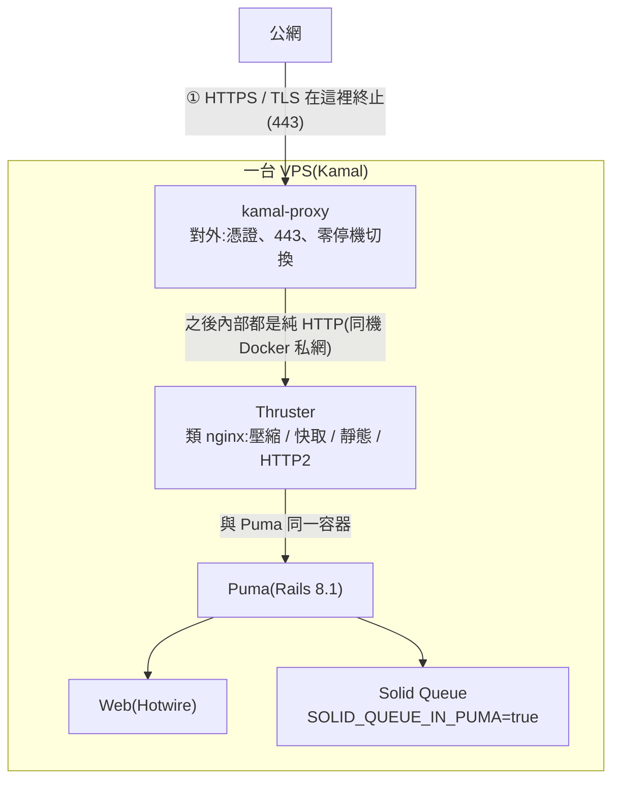

# Sendora 請求路徑:反向代理與 HTTPS 分層

> 一個請求從公網進來,到跑你的 Rails 程式,中間經過哪幾層、各自負責什麼。
> 重點回答兩個問題:**誰負責 HTTPS**、**誰扮演傳統上 nginx 的角色**。
>
> 系統整體架構見 [IMPLEMENTATION_GUIDE.md §3](IMPLEMENTATION_GUIDE.md#3-系統架構);
> 部署設定見 [§8 部署](IMPLEMENTATION_GUIDE.md#8-部署kamal單機)。

## 一句話定位

傳統單機你要自己裝「**nginx**(TLS + 反向代理 + 靜態檔)+ **應用伺服器**」。
這專案把它拆成三層,全是 Rails / Kamal 生態自帶,免手動裝設定 nginx、也免自己弄憑證:

| 層 | 元件 | 對應傳統角色 |
|---|---|---|
| 對外邊緣 | **kamal-proxy** | nginx 的 **TLS 終止 + 反向代理** |
| 應用前加速 | **Thruster** | nginx 的 **壓縮 / 靜態快取 / X-Sendfile** |
| 應用伺服器 | **Puma** | 跑 Rails 程式(含 Solid Queue) |

## 請求路徑



## 各層職責

### ① 負責 HTTPS:kamal-proxy

Kamal 2 內建的代理(Kamal 1 時代才是用 Traefik),部署時自動跑在 VPS 上。

設定就在 `config/deploy.yml`:

```yaml
proxy:
  ssl: true                    # 開 TLS
  host: sendora.example.com    # 向 Let's Encrypt 申請此網域憑證
```

它做的事:

- **TLS 終止**:向 Let's Encrypt 自動申請 / 續期憑證,把 443 的 HTTPS 解密。
- **反向代理**:解密後以純 HTTP 往內送給 Thruster。
- **零停機切換**:部署新版本時做健康檢查 + 請求緩衝,舊版本流量排空後才切過去。

> 從 kamal-proxy 往內(到 Thruster / Puma)都是**明文 HTTP**——同一台機器、走 Docker 私網,不需要再加密。

### ② 扮演 nginx 角色:Thruster

包在 Puma 前面、跟 Puma 同一容器,進入點在 `Dockerfile`:

```dockerfile
CMD ["./bin/thrust", "./bin/rails", "server"]
```

它做的正是傳統上你會交給 nginx 的那些活:

- **gzip / 壓縮**回應
- **靜態資產快取**(`public/assets` 下帶 fingerprint 的 JS / CSS)
- **X-Sendfile**:大檔(如 Active Storage 下載)交給它送,不佔用 Puma worker
- **HTTP/2**

它**不碰 TLS**(那是 kamal-proxy 的事),純粹是應用前的加速層。

### ③ 應用伺服器:Puma

真正跑 controller / view 的 Rails 應用伺服器。
本專案 `SOLID_QUEUE_IN_PUMA=true`,背景工作(寄信、CSV 匯入/匯出)也跑在 Puma 進程內,不另起 worker。量大了再拆獨立 `bin/jobs` 容器,程式碼不用改。

## 為什麼不在前面再疊 nginx / Caddy / Traefik

一般反向代理的活——TLS、壓縮、快取、靜態檔——**已經被 kamal-proxy + Thruster 兩層包掉**。
再往最前面疊一個 nginx / Caddy / Traefik,多數情況只是**雙重代理、多一跳**,沒有收益。

單機單一 app、走 Kamal 的情境下,維持現狀(kamal-proxy + Thruster)就是 Kamal 設計好的正道,零額外維運。

## 什麼時候才該動代理層

- **同機要跑多個 app / 多網域**:kamal-proxy 本身就支援多 app,先試它;真要 Docker label 動態路由,再考慮 **Traefik**。
- **要脫離 Kamal proxy、自己管 TLS + 路由**:選 **Caddy**(內建自動 HTTPS、Caddyfile 極簡,理念跟 kamal-proxy 一致)。
- **需要很細的調校**(複雜 rewrite、限流、特殊 header、大量靜態檔)或團隊本就熟 nginx:才值得上 **nginx**,但要自己接 certbot 管憑證、設定全手動,與本專案「免維運、自成一體」的取向相反。

## 相關設定檔

| 檔案 | 相關段落 |
|---|---|
| `config/deploy.yml` | `proxy.ssl` / `proxy.host`(kamal-proxy TLS) |
| `Dockerfile` | 結尾 `CMD ["./bin/thrust", ...]`(Thruster 進入點) |
| `Gemfile` | `gem "thruster"`、`gem "kamal"` |
